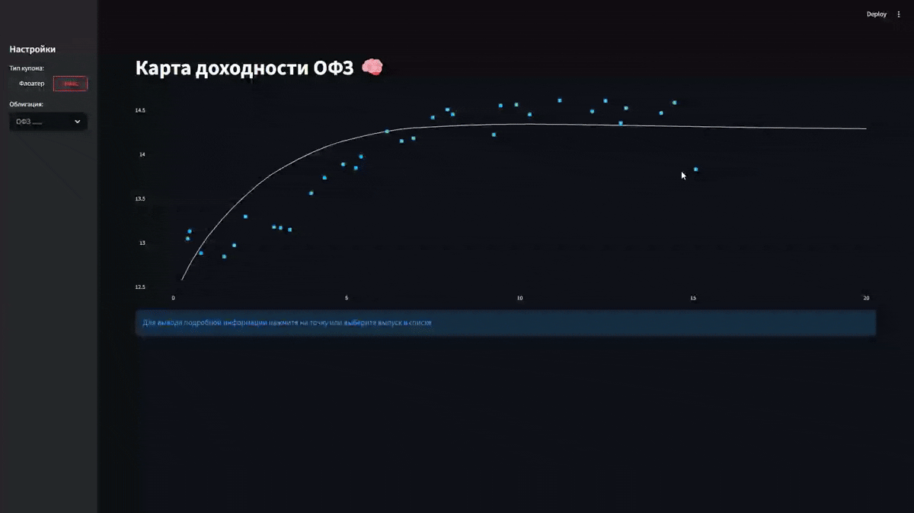

# OFZ Yield Dashboard

Interactive dashboard for analyzing Russian government bonds (OFZ) using data from Moscow Exchange (MOEX)

**Live Demo:**  (will be added after deployment)



---

## Overview

This project is an interactive analytics tool that provides **Yield Map** visualization for OFZ bonds, allowing users to:

*   **Explore bond yields** across various maturities
*   **Compare bonds** against key market benchmarks
*   **Inspect detailed metrics** through interactive bond selection

---

## Key Features

- **Bond segmentation by coupon type**
  - Fixed-rate bonds: yield spread analysis vs. **ZCYC** (Zero-Coupon Yield Curve)
  - Floating-rate bonds (Floaters): performance tracking vs. **RUSFAR** (Russian Secured Funding Average Rate)

- **Interactive yield map**
  - Hybrid visualization combining a scatter plot of individual bonds with an interpolated yield curve (fixed-rate segment)
  - Interactive bond selection via chart or dropdown selector

- **Dynamic metrics panel**
  - Core indicators: Yield (YTM), Duration, Price, Accrued Interest
  - Coupon details: coupon rate (%), payment frequency, last coupon date, maturity date

- **Market data & performance**
  - MOEX data feed with 15-minute delay
  - Optimized cache (10-minute TTL) for responsive analysis and efficient comparison

## Project Structure

```text
.
├── app.py              # Main Streamlit app (orchestration & state)
├── data.py             # Data layer (MOEX API, preprocessing, enrichment)
├── visualization.py    # Chart creation (Plotly)
├── ui.py               # UI components & user interaction logic
├── requirements.txt    # Project dependencies
├── README.md           # Project documentation
└── assets/
    └── demo.gif        # Demo animation for README
```

### Responsibilities

* **app.py**

  * Controls app flow
  * Manages session state
  * Connects UI ↔ data ↔ visualization

* **data.py**

  * Fetches data from MOEX ISS API
  * Cleans and transforms datasets
  * Computes financial metrics (TTM, spreads, duration)

* **visualization.py**

  * Builds interactive Plotly charts
  * Handles selection logic and highlighting

* **ui.py**

  * Renders UI components (sidebar, metrics)
  * Handles user feedback and errors

---

## How to Run

```bash
pip install -r requirements.txt
streamlit run app.py
```

---

## Data Source

MOEX ISS API

---

## Built With

* Streamlit
* Pandas / NumPy
* Plotly
* SciPy (PchipInterpolator)
* Requests

---

## Future Improvements

* Add multi-language Support (EN/RU toggle)
* Add export/download functionality

---
